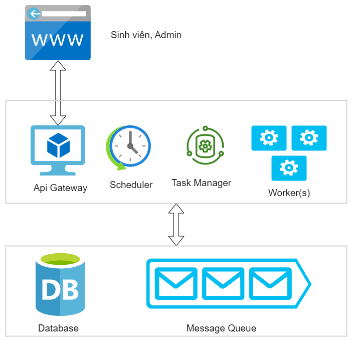

# dkhptd

đăng ký học phần tự động cho sinh viên đại học bách khoa hà nội

mặc dù tên project là đăng ký học phần tự động tuy nhiên project này làm được những việc sau:

- hẹn giờ đăng ký lớp tự động trên trang [https://dk-sis.hust.edu.vn](https://dk-sis.hust.edu.vn)
  - khi đến hẹn giờ hệ thống sẽ tự động thực thi đăng ký trên trang dk-sis
  - sinh viên không cần can thiệp trong quá trình đăng ký, sinh viên chỉ cần chờ kết quả
- crawl thời khóa biểu của sinh viên trên trang [https://ctt-sis.hust.edu.vn](https://ctt-sis.hust.edu.vn)
- crawl chương trình học của sinh viên trên trang [https://ctt-sis.hust.edu.vn](https://ctt-sis.hust.edu.vn)

## Project Structure

project được triển khai dưới dạng nhiều module, được triển khai độc lập

- [dkhptd-api-gateway](https://github.com/tuana9a/dkhptd-api-gateway): api server xử lý các request từ trình duyệt
- [dkhptd-scheduler](https://github.com/tuana9a/dkhptd-scheduler): bộ hẹn giờ liên tục kiểm tra xem đã tới thời điểm hẹn giờ của sinh viên hay chưa, nếu đã đến giờ sẽ gửi yêu cầu này cho worker thông qua message queue
- [dkhptd-worker](https://github.com/tuana9a/dkhptd-worker): thực thi các yêu cầu đăng ký tự động, sau khi xử lý xong sẽ gửi kết quả vào message queue cho taskamager xử lý
- [dkhptd-taskmanager](https://github.com/tuana9a/dkhptd-taskmanager): xử lý kết quả mà worker trả về để có các logic xử lý như tự động thử đăng ký lại
- [hust-tkb-xlsx-parser](https://github.com/tuana9a/hust-tkb-xlsx-parser) ( _optional_ ): xử lý file excel thời khóa biểu dự kiến của nhà trường để trích xuất thông tin

các module trên sẽ truy cập, trao đổi thông tin thông qua database là [MongoDB](https://www.mongodb.com/docs/v5.0/tutorial/getting-started/) và message queue là [RabbitMQ](https://www.rabbitmq.com/getstarted.html)

chi tiết từng module các bạn hãy click vào module tương ứng

